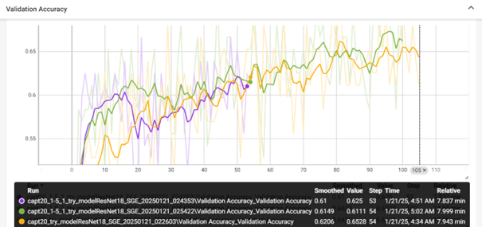

# One-Shot Learning with Deep Learning

## Introduction
This project implements **One-Shot Learning** for recognition military equipment. It leverages **ResNet18 with Spatial Group-wise Enhancements (SGE)** for feature extraction and employs metric learning strategies such as **Triplet Loss**. The training process includes both classification-based pretraining and metric-based fine-tuning.

## Table of Contents
- [Introduction](#introduction)
- [Project description](#project-description)
- [Installation](#installation)
- [Usage](#usage)
- [Datasets](#datasets)
- [Features](#features)
- [Configuration](#configuration)
- [Training Process](#training-process)
- [Inference](#inference)
- [Results](#results)
- [Dependencies](#dependencies)
- [Troubleshooting](#troubleshooting)
- [Contributors](#contributors)
- [License](#license)

## Project description
The goal of this project is to solve the problem of recognizing military equipment in the absence of a large number of training examples by class (**One-Shot Learning**). As a basis for the model, I chose Resnet, which can be replaced with Inception if desired. Then I modified it with the help of attention mechanisms, and two versions were implemented. The first one is a combination of channel and spatial attention and is called **[CBAM](https://arxiv.org/abs/1807.06521)**. The second one is **[SGE](https://arxiv.org/pdf/1905.09646)** (Spatial Group-wise Enhance), which is more optimized, requires less computation, and works faster.

Consider the training process. First, I chose a trained resnet on a common recognition task from the torchvision library. Next, I modified this model using the developed attention mechanisms. I pre-trained this model to classify images from a large clean dataset.  The last part was to create a **triplet loss** to train a **Siamese neural network**. This network was fine-tuned using a small real-world drone dataset that has many complex images to recognize. For this training, triplets were generated using the **[hard batching](https://arxiv.org/pdf/1703.07737)** method.

The training was conducted using notebooks on the kaggle service using a GPU P100.

## Installation
To set up the environment, run:

```bash
pip install -r requirements.txt
```

## Usage
Run the training pipeline:

```bash
python train.py --configs config_pretrain.yaml config_model.yaml
```

Run the creation database pipeline:

```bash
python siamese_features_db.py --configs models_weights.yaml config_train.yaml
```

## Datasets
[Military Decision-Making Dataset](https://www.kaggle.com/datasets/nzigulic/military-equipment)
The dataset comprises 11,800 images and labels tailored for the YOLO detection algorithm, categorizing objects as follows:
1) Tank (TANK).
2) Infantry fighting vehicle (IFV).
3) Armored personnel carrier (APC).
4) Engineering vehicle (EV).
5) Assault helicopter (AH).
6) Transport helicopter (TH).
7) Assault airplane (AAP).
8) Transport airplane (TA).
9) Anti-aircraft vehicle (AA).
10) Towed artillery (TART).
11) Self-propelled artillery (SPART).

This dataset is clear (has good quality images from different angles, the equipment is clearly visible and poorly disguised), so it will be used for pretraining model

[2022 Russia Ukraine War, Losses, Oryx + Images](https://www.kaggle.com/datasets/piterfm/2022-ukraine-russia-war-equipment-losses-oryx)
The dataset describes russian and Ukrainian Equipment Losses During The 2022 Russian Invasion Of Ukraine. This list only includes destroyed vehicles and equipment of which photo or videographic evidence is available. Therefore, the amount of equipment destroyed is significantly higher than recorded. You can find numbers here 2022 Ukraine Russia War Dataset.

This dataset has real images from drones. The equipment has good camouflage and is in combat conditions. However, since this dataset is designed to calculate losses, most of the equipment is severely damaged and broken into small pieces. Some confirmations of losses are screenshots from posts relevant to our task. Also, many vehicles have anti-drone grilles that cover most of the body. Thus, this dataset needs to be manually sorted, selecting only a small portion of instances for our task.

## Features
- One-Shot Learning with Triplet Loss
- ResNet18 with SGE or CBAM attention module for feature extraction
- Data augmentation by torchvision
- Triplets are created using hard batching
- Custom dataset handling with CustomDataset and TripletDataset
- Logging and Metrics tracking (TensorBoard supported)
- YAML-based configurations for flexibility
- EDA was introduced as jupyter-notebooks

## Configuration
Modify YAML files in the *configs/* directory to adjust:

- Model hyperparameters
- Training settings
- Preprocessing settings

## Training Process

1. Pretraining: Classification-based learning on the big dataset.
2. Fine-Tuning: Training real dataset the Siamese Network with Triplet Loss.

## Inference
To obtain results run inference pipeline:

```bash
python inference.py --configs models_weights.yaml config_inference.yaml config_model.yaml config_train.yaml
```

## Metrics
- Training and Validation Loss
- Accuracy over Validation Set
- Recall and Precision over Validation Set
- Similarity Score Distributions

## Results
### Results of pretraining classification model on a big clear dataset (*Military Decision-Making*):

Training and Validation loss


Validation metrics


### Results of training siamese model on a big clear dataset (*Military Decision-Making*):

Training and Validation loss


MAP graph for Validation data


### Results of training siamese model on a small real dataset (*2022 Russia Ukraine War, Losses, Oryx + Images*):

Training and Validation loss


Accuracy



MAP graph for Validation part of real dataset


## Dependencies
- Python 3.x
- PyTorch
- torchvision
- NumPy
- Pandas
- scikit-learn
- tqdm
- PIL

## Troubleshooting
1. CUDA issues? Ensure PyTorch is installed with GPU support.
2. Dataset errors? Check dataset paths in configs/config_train.yaml.